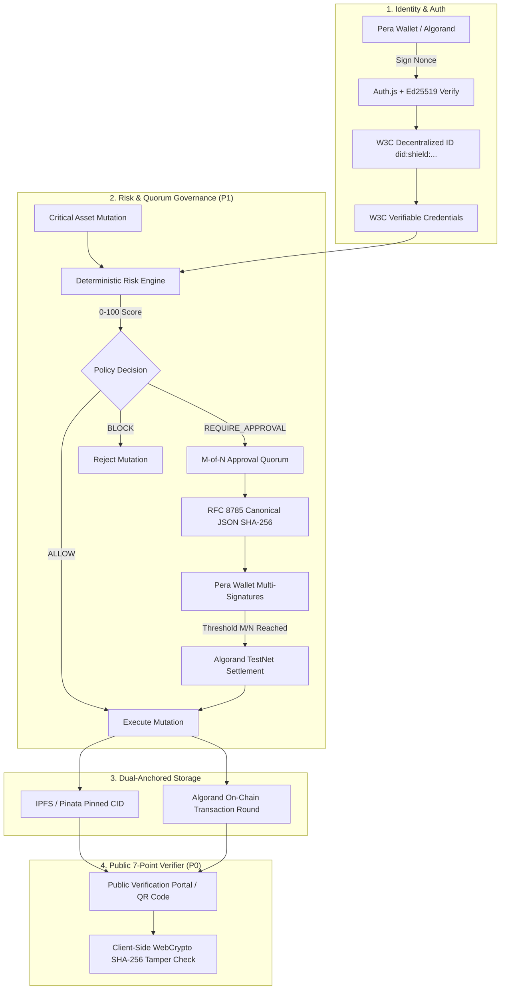

# 🛡️ SHIELD — Verifiable Trust Infrastructure

> **Blockchain-Backed Secure Identity, Cryptographic Multi-Party Governance & Asset Integrity**

[](https://shield-mocha-eight.vercel.app)
[](https://testnet.explorer.perawallet.app)
[](https://www.w3.org/TR/did-core/)
[](https://www.rfc-editor.org/rfc/rfc8785)
[](https://nextjs.org)

---

## 📖 Quick Overview: What is SHIELD?

**SHIELD** is an institutional-grade security platform that transforms enterprise access control from **passive detection** to **active cryptographic prevention**.

In traditional enterprise platforms (like Okta, Google Drive, or AWS IAM), a single compromised administrator or stolen password can delete databases, leak classified documents, or hijack assets. 

**SHIELD eliminates this single point of failure:**
1. **Zero Passwords**: Every employee and admin authenticates via their sovereign **Algorand Pera Wallet** and holds a **W3C Decentralized Identity (DID)**.
2. **Multi-Party M-of-N Quorums**: Critical actions (such as transferring classified blueprints or revoking admin keys) **cannot be executed unilaterally**. They require multi-party wallet approvals.
3. **Deterministic Risk & Trust Engine**: A real-time 0–100 explainable security score that checks file checksums, credential revocations, and on-chain timestamps.
4. **Dual-Anchored Document Integrity**: Files are stored on decentralized **IPFS** and timestamped immutably on the **Algorand blockchain**.
5. **Zero-Knowledge 7-Point Verifier**: Anyone with an asset link or QR code can publicly verify document authenticity in their browser without uploading sensitive files.

---

## 🏛️ System Architecture



---

## 🌟 Core Capabilities Explained Simply

### 1. 🔑 Sovereign Passwordless Identity (W3C DID)
- Users never create or remember passwords.
- Logging in is a simple **Pera Wallet cryptographic handshake**: The server issues a time-bounded challenge, your wallet signs it with your private key (Ed25519), and SHIELD verifies it with `algosdk.verifyBytes`.
- Every identity is issued a permanent **W3C Decentralized Identifier**:
  `did:shield:user:<ALGORAND_ADDRESS>`

---

### 2. 👥 M-of-N Cryptographic Quorums (P1)
- **The Problem**: A rogue or phished super-admin could steal or delete high-value assets.
- **The SHIELD Solution**: High-risk actions on `CONFIDENTIAL`, `SECRET`, or `CRITICAL` assets are locked until **$M$ out of $N$ authorized leads** sign the request with their hardware/mobile wallets.
- **Anti-Self-Approval**: Requesters are mathematically barred from approving their own actions.
- **RFC 8785 Canonical Serialization**: Guarantees that every approver signs the exact deterministic JSON payload byte-for-byte.
- **Stale-State Protection**: If an asset is altered while an approval is pending, the request immediately auto-invalidates.

---

### 3. 🧠 Deterministic Risk & Trust Engine (P1)
- Unlike opaque "AI black boxes" that hallucinate, SHIELD uses a **100% deterministic, explainable mathematical score**:
  
  $$\text{Trust Score} = 100 - \text{Risk Score}$$

- **5 Real-Time Evaluated Signals**:
  1. **Asset Classification**: Public vs. Confidential vs. Secret vs. Critical.
  2. **Document File Tamper Status**: Real-time comparison against on-chain genesis digests.
  3. **W3C Credential Status**: Active vs. Revoked security clearances.
  4. **Blockchain Anchoring**: Algorand TestNet confirmed transaction round.
  5. **24h Audit Velocity**: Anomaly velocity and access violation spikes.

---

### 4. 📜 W3C Verifiable Credentials (P0)
- Administrators issue cryptographic credentials (e.g. `SecurityClearanceCredential`, `AssetCustodianCredential`).
- **Instant Revocation Tracking**: When an employee departs, admins revoke their credential with one click. The Risk Engine instantly flags the revocation and blocks subsequent mutations across the entire organization.

---

### 5. 🔍 Public 7-Point Zero-Knowledge Verifier (P0)
- Anyone (auditors, regulators, partners) can scan an asset QR code or visit `https://shield-mocha-eight.vercel.app/verify/<assetId>` **without logging in**.
- **Browser-Based Zero-Knowledge Tamper Verification**: Drop any local file into the verifier box. Your browser computes the SHA-256 hash in memory using the WebCrypto API and proves whether the file matches the Algorand blockchain genesis anchor.

---

## 👑 Organization Roles & Permissions (RBAC)

```
   ┌───────────────┐
   │     OWNER     │  ── Highest authority, root policy configuration, org management
   └───────┬───────┘
           │
   ┌───────▼───────┐
   │     ADMIN     │  ── Credential issuer, quorum signer, asset classifier
   └───────┬───────┘
           │
   ┌───────▼───────┐
   │    MANAGER    │  ── Department head, initiates quorum transfer workflows
   └───────┬───────┘
           │
   ┌───────▼───────┐
   │  USER / MEMBER│  ── Employee, sovereign DID holder, asset custodian
   └───────────────┘

   ┌───────────────┐
   │    AUDITOR    │  ── Independent compliance viewer, read-only proof verifier
   └───────────────┘
```

---

## 🛠️ Technology Stack

| Layer | Technology | Purpose |
|---|---|---|
| **Frontend & Backend** | [Next.js 16](https://nextjs.org) (App Router, Turbopack, React 19) | Full-stack server actions, responsive UI |
| **Styling & Design** | [Tailwind CSS 4](https://tailwindcss.com) + Radix UI | Apple × Notion minimalist design system |
| **Database** | [Neon Serverless PostgreSQL](https://neon.tech) + [Drizzle ORM](https://orm.drizzle.team) | Relational multi-tenant storage |
| **Authentication** | [Auth.js v5](https://authjs.dev) + [Pera Wallet](https://perawallet.app) | Non-custodial Ed25519 signature authentication |
| **Blockchain** | [Algorand TestNet](https://algorand.technologies) (`algosdk`) | Immutable state proofs, ASA tokens, & round consensus |
| **Decentralized Storage** | [Pinata IPFS](https://pinata.cloud) | Content-addressed decentralized document pinning |
| **Standards** | W3C DID Core 1.0, W3C Verifiable Credentials, RFC 8785 | Open, interoperable cryptographic standards |

---

## 🚀 Getting Started Locally

### 1. Prerequisites
- **Node.js**: `v20+` or `v24+`
- **Package Manager**: `npm` or `pnpm`
- **Algorand Wallet**: [Pera Wallet](https://perawallet.app) (Web or Mobile set to TestNet)

### 2. Clone the Repository
```bash
git clone https://github.com/Saisathvik94/shield.git
cd shield
```

### 3. Install Dependencies
```bash
npm install
# or: pnpm install
```

### 4. Configure Environment Variables
Create a `.env` file in the root directory:

```env
# Neon PostgreSQL Connection
DATABASE_URL="postgresql://<user>:<password>@<host>/neondb?sslmode=require"

# Auth.js Secret & Domain
AUTH_SECRET="your-secure-random-secret"
NEXTAUTH_URL="http://localhost:3000"
NEXT_PUBLIC_APP_URL="https://shield-mocha-eight.vercel.app"

# Pinata IPFS Credentials
PINATA_JWT="your-pinata-jwt-token"
PINATA_GATEWAY="your-subdomain.mypinata.cloud"

# Algorand TestNet
ALGORAND_NODE_URL="https://testnet-api.algonode.cloud"
ALGORAND_NODE_TOKEN=""
ALGORAND_INDEXER_URL="https://testnet-idx.algonode.cloud"

# SHIELD Protocol Treasury Account (Server-side only)
ALGORAND_TREASURY_MNEMONIC="your 25 word testnet mnemonic phrase"
```

### 5. Run Database Migrations
```bash
npm run db:push
```

### 6. Start the Development Server
```bash
npm run dev
```

Open your browser and navigate to:
👉 **[http://localhost:3000](http://localhost:3000)**

---

## 🧪 Automated Testing & Verification

Run the comprehensive security and automated test suites:

```bash
# Run P0 Verifiable Trust & Tamper Detection Suite (33 Scenarios)
npx tsx --env-file=.env scratch/test-p0-scenarios.ts

# Run P1 Multi-Party Quorum & Risk Engine Suite (33 Scenarios)
npx tsx --env-file=.env scratch/test-p1-scenarios.ts

# Run Next.js Production Build Verification
npm run build
```

---

## 🎬 Dual-Actor Live Demo Guide

To demonstrate SHIELD during a live presentation:

1. **Window 1 (Chrome — Organization Admin)**:
   - Log in at `http://localhost:3000/login` with your Admin wallet.
   - Go to **Members** and invite a new team member (`employee@defense.corp`).
   - Issue a `SecurityClearanceCredential` to the employee.
   - Register a `SECRET` asset (e.g. `Defense Radar Blueprint v4`) and assign custody to the employee.

2. **Window 2 (Incognito — Employee / User)**:
   - Accept the invite link, connect wallet, and observe your sovereign **W3C DID**.
   - Open the asset passport and click **"Transfer Custody"**.
   - **Show the Audience**: The transfer is automatically gated behind an **M-of-N Approval Quorum**.
   - Try to self-approve → System displays **Anti-Self-Approval blocked**.

3. **Window 1 (Admin signs)**:
   - Go to `/dashboard/approvals`, inspect the **RFC 8785 Canonical Digest**, and click **"Sign with Pera Wallet"**.
   - Watch the quorum reach `2/2` and atomically transition to **`EXECUTED`** on the Algorand blockchain.

4. **Public Verification**:
   - Open `/verify/<assetId>` in any browser or mobile phone.
   - Drop the original file into the **Zero-Knowledge Verifier** to prove zero tampering against the Algorand blockchain!

---

## 📄 License

This project is licensed under the **MIT License** — see the [LICENSE](LICENSE) file for details.
